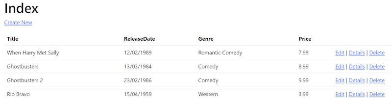

# Working with a Database

The ``RazorPagesMovieContext`` object handles the task of connecting to the database and mapping ``Movie`` objects to database records. The database context is registered with the [Dependency Injection](https://learn.microsoft.com/en-us/aspnet/core/fundamentals/dependency-injection?view=aspnetcore-9.0) container in Program.cs:

```bash
builder.Services.AddDbContext<RazorPagesMovieContext>(options =>
    options.UseSqlServer(builder.Configuration.GetConnectionString("RazorPagesMovieContext") ?? throw new InvalidOperationException("Connection string 'RazorPagesMovieContext' not found.")));
```

The ASP.NET Core [Configuration](https://learn.microsoft.com/en-us/aspnet/core/fundamentals/configuration/?view=aspnetcore-9.0) system reads the ``ConnectionString`` key. For local development, configuration gets the connection string from the ``appsettings.json`` file.

```bash
"ConnectionStrings": {
    "RazorPagesMovieContext": "Server=(localdb)\\mssqllocaldb;Database=RazorPagesMovieContext-f2e0482c-952d-4b1c-afe9-a1a3dfe52e55;Trusted_Connection=True;MultipleActiveResultSets=true"
  }
```

## Seed the database

Create a new class named ``SeedData`` in the ``Models`` folder with the following code:

```bash
using Microsoft.EntityFrameworkCore;
using RazorPagesMovie.Data;

namespace RazorPagesMovie.Models
{
    public class SeedData
    {
        public static void Initialize(IServiceProvider serviceProvider)
        {
            using (var context = new RazorPagesMovieContext(
                serviceProvider.GetRequiredService<
                    DbContextOptions<RazorPagesMovieContext>>()))
            {
                if (context == null || context.Movie == null)
                {
                    throw new ArgumentNullException("Null RazorPagesMovieContext");
                }

                // Look for any movies.
                if (context.Movie.Any())
                {
                    return;   // DB has been seeded
                }

                context.Movie.AddRange(
                    new Movie
                    {
                        Title = "When Harry Met Sally",
                        ReleaseDate = DateTime.Parse("1989-2-12"),
                        Genre = "Romantic Comedy",
                        Price = 7.99M
                    },

                    new Movie
                    {
                        Title = "Ghostbusters ",
                        ReleaseDate = DateTime.Parse("1984-3-13"),
                        Genre = "Comedy",
                        Price = 8.99M
                    },

                    new Movie
                    {
                        Title = "Ghostbusters 2",
                        ReleaseDate = DateTime.Parse("1986-2-23"),
                        Genre = "Comedy",
                        Price = 9.99M
                    },

                    new Movie
                    {
                        Title = "Rio Bravo",
                        ReleaseDate = DateTime.Parse("1959-4-15"),
                        Genre = "Western",
                        Price = 3.99M
                    }
                );
                context.SaveChanges();
            }
        }
    }
}
```

**Note:** If there are any movies in the database, the seed initializer returns and no movies are added.

```bash
    if (context.Movie.Any())
    {
        return;
    }
```

### Add the seed initializer

Update the ``Program.cs`` code.

```bash
    var app = builder.Build();

    using (var scope = app.Services.CreateScope())
    {
        var services = scope.ServiceProvider;

        SeedData.Initialize(services);
    }
```

In the previous code, ``Program.cs`` has been modified to do the following:

Get a database context instance from the dependency injection (DI) container.
Call the ``seedData.Initialize`` method, passing to it the database context instance.
Dispose the context when the seed method completes. The [using statement](https://learn.microsoft.com/en-us/dotnet/csharp/language-reference/keywords/using-statement) ensures the context is disposed.

### Test the app

Delete all the records in the database so the seed method will run. Stop and start the app to seed the database. If the database isn't seeded, put a breakpoint on if (``context.Movie.Any()``) and step through the code.

The app shows the seeded data.


