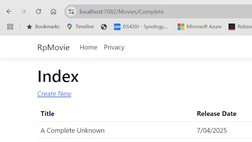
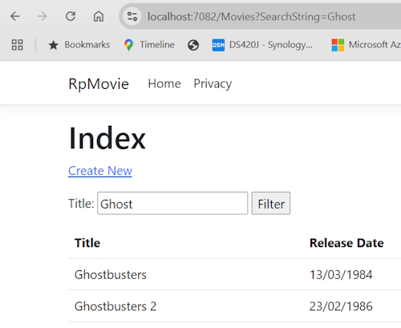
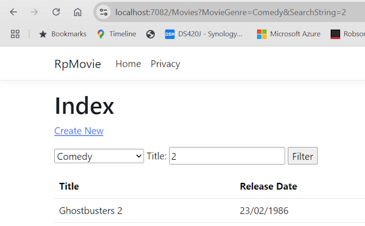

# Add search to ASP.NET Core Razor Pages

In the following sections, searching movies by ``genre`` or ``name`` is added.

Add the following highlighted code to ``Pages/Movies/Index.cshtml.cs`` after ``IList<Movie>``:

```bash
    [BindProperty(SupportsGet = true)]
    public string? SearchString { get; set; }

    public SelectList? Genres { get; set; }

    [BindProperty(SupportsGet = true)]
    public string? MovieGenre { get; set; }
```

In the previous code:

``SearchString``: Contains the text users enter in the search text box. ``SearchString`` has the [BindProperty] attribute. 
[[BindProperty]](https://learn.microsoft.com/en-us/dotnet/api/microsoft.aspnetcore.mvc.bindpropertyattribute) binds form values and query strings with the same name as the property. ``[BindProperty(SupportsGet = true)]`` is required for binding on HTTP GET requests.

``Genres``: Contains the list of genres. ``Genres`` allows the user to select a genre from the list. ``SelectList`` requires using ``Microsoft.AspNetCore.Mvc.Rendering;``

``MovieGenre``: Contains the specific genre the user selects. For example, "Western".

``Genres`` and ``MovieGenre`` are used later.

## Warning

For security reasons, you must opt in to binding ``GET`` request data to page model properties. Verify user input before mapping it to properties. Opting into ``GET`` binding is useful when addressing scenarios that rely on query string or route values.

To bind a property on ``GET`` requests, set the [BindProperty] attribute's ``SupportsGet`` property to ``true``:

```bash
    [BindProperty(SupportsGet = true)]
```

Update the ``Movies/Index`` page's ``OnGetAsync`` method with the following code:

```bash
    public async Task OnGetAsync()
    {
        var movies = from m in _context.Movie
                     select m;
        if (!string.IsNullOrEmpty(SearchString))
        {
            movies = movies.Where(s => s.Title.Contains(SearchString));
        }

        Movie = await movies.ToListAsync();
    }
```

The first line of the ``OnGetAsync`` method creates a [LINQ](https://learn.microsoft.com/en-us/dotnet/csharp/programming-guide/concepts/linq/) query to select the movies:

```bash
    var movies = from m in _context.Movie
        select m;
```

The query is only **defined** at this point, it has not been run against the database.

If the ``SearchString`` property is not null or empty, the ``movies`` query is modified to filter on the search string:

```bash
    if (!string.IsNullOrEmpty(SearchString))
    {
        movies = movies.Where(s => s.Title.Contains(SearchString));
    }
```

The ``s => s.Title.Contains()`` code is a [Lambda Expression](https://learn.microsoft.com/en-us/dotnet/csharp/programming-guide/statements-expressions-operators/lambda-expressions). Lambdas are used in method-based ``LINQ`` queries as arguments to standard query operator methods such as the [Where](https://learn.microsoft.com/en-us/dotnet/csharp/programming-guide/concepts/linq/query-syntax-and-method-syntax-in-linq) method or ``Contains``. LINQ queries are not executed when they're defined or when they're modified by calling a method, such as ``Where``, ``Contains``, or ``OrderBy``. Rather, query execution is deferred. The evaluation of an expression is delayed until its realized value is iterated over or the ``ToListAsync`` method is called. See [Query Execution](https://learn.microsoft.com/en-us/dotnet/csharp/linq/get-started/introduction-to-linq-queries#deferred) for more information.

**Note:** The [Contains](https://learn.microsoft.com/en-us/dotnet/api/system.data.objects.dataclasses.entitycollection-1.contains) method is run on the database, not in the C# code. The case sensitivity on the query depends on the database and the collation. On SQL Server, Contains`` maps to [SQL LIKE](https://learn.microsoft.com/en-us/sql/t-sql/language-elements/like-transact-sql), which is case insensitive.

Navigate to the Movies page and append a query string such as ``?searchString=Ghost`` to the URL. For example, ``https://localhost:5001/Movies?searchString=Ghost``. The filtered movies are displayed.

If the following route template is added to the **Index** page, the search string can be passed as a URL segment. For example, ``https://localhost:5001/Movies/Ghost``.

```bash
    @page "{searchString?}"
```

The preceding route constraint allows searching the title as route data (a URL segment) instead of as a query string value. The ``?`` in ``"{searchString?}"`` means this is an **optional** route parameter.



The ASP.NET Core runtime uses model binding to set the value of the ``SearchString`` property from the query string (``?searchString=Ghost``) or route data (``https://localhost:5001/Movies/Ghost``). Model binding is **not** case sensitive.

However, users cannot be expected to modify the URL to search for a movie. In this step, UI is added to filter movies. If you added the route constraint ``"{searchString?}"``, remove it.

Open the ``Pages/Movies/Index.cshtml`` file, and add the markup after ``Create New`` in the following code:

```bash
    <form>
        <p>
            <label>Title: <input type="text" asp-for="SearchString" /></label>
            <input type="submit" value="Filter" />
        </p>
    </form>
```

The HTML ``<form>`` tag uses the following Tag Helpers:

[Form Tag Helper](https://learn.microsoft.com/en-us/aspnet/core/mvc/views/working-with-forms?view=aspnetcore-9.0#the-form-tag-helper). When the form is submitted, the filter string is sent to the *Pages/Movies/Index* page via query string.

[Input Tag Helper](https://learn.microsoft.com/en-us/aspnet/core/mvc/views/working-with-forms?view=aspnetcore-9.0#the-input-tag-helper)

Save the changes and test the filter.



## Search by genre

Update the ``Movies/Index.cshtml.cs`` page ``OnGetAsync`` method with the following code:

```bash
    public async Task OnGetAsync()
    {
        // <snippet_search_linqQuery>
        IQueryable<string> genreQuery = from m in _context.Movie
                                        orderby m.Genre
                                        select m.Genre;
        // </snippet_search_linqQuery>

        var movies = from m in _context.Movie
                     select m;

        if (!string.IsNullOrEmpty(SearchString))
        {
            movies = movies.Where(s => s.Title.Contains(SearchString));
        }

        if (!string.IsNullOrEmpty(MovieGenre))
        {
            movies = movies.Where(x => x.Genre == MovieGenre);
        }

        // <snippet_search_selectList>
        Genres = new SelectList(await genreQuery.Distinct().ToListAsync());
        // </snippet_search_selectList>
        Movie = await movies.ToListAsync();
    }
```

The following code is a LINQ query that retrieves all the genres from the database.

```bash
    IQueryable<string> genreQuery = from m in _context.Movie
                                        orderby m.Genre
                                        select m.Genre;
```

The ``SelectList`` of genres is created by projecting the distinct genres:

```bash
    Genres = new SelectList(await genreQuery.Distinct().ToListAsync());
```

### Add search by genre to the Razor Page

Update the ``Index.cshtml`` [<form>](https://developer.mozilla.org/docs/Web/HTML/Element/form) element as highlighted in the following markup:

```bash
    <form>
        <p>
            <select asp-for="MovieGenre" asp-items="Model.Genres">
                <option value="">All</option>
            </select>
            <label>Title: <input type="text" asp-for="SearchString" /></label>
            <input type="submit" value="Filter" />
        </p>
    </form>
```

Test the app by searching by genre, by movie title, and by both:


