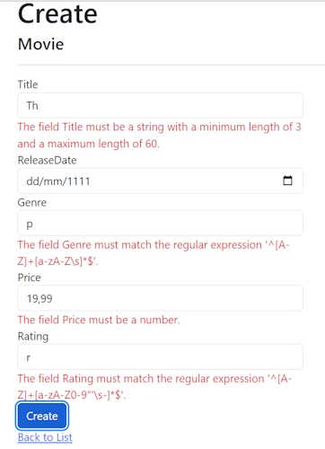

# Validation in ASP.Net Razor Pages

In this section, validation logic is added to the ``Movie`` model. The validation rules are enforced any time a user creates or edits a movie.

## Validation

A key tenet of software development is called DRY ("Don't Repeat Yourself"). Razor Pages encourages development where functionality is specified once, and it's reflected throughout the app. DRY can help:

* Reduce the amount of code in an app.
* Make the code less error prone, and easier to test and maintain.

The validation support provided by Razor Pages and Entity Framework is a good example of the DRY principle:

* Validation rules are declaratively specified in one place, in the model class.
* Rules are enforced everywhere in the app.

## Add validation rules to the movie model

The [System.ComponentModel.DataAnnotations](https://learn.microsoft.com/en-us/dotnet/api/system.componentmodel.dataannotations) namespace provides:

* A set of built-in validation attributes that are applied declaratively to a class or property.
* Formatting attributes like [DataType] that help with formatting and don't provide any validation.

Update the ``Movie`` class to take advantage of the built-in ``[Required]``, ``[StringLength]``, ``[RegularExpression]``, and ``[Range]`` validation attributes.

```bash
using System.ComponentModel.DataAnnotations;
using System.ComponentModel.DataAnnotations.Schema;

namespace RazorPagesMovie.Models;

public class Movie
{
    public int Id { get; set; }

    [StringLength(60, MinimumLength = 3)]
    [Required]
    public string Title { get; set; } = string.Empty;

    [DataType(DataType.Date)]
    public DateTime ReleaseDate { get; set; }

    [Range(1, 100)]
    [DataType(DataType.Currency)]
    [Column(TypeName = "decimal(18, 2)")]
    public decimal Price { get; set; }

    [RegularExpression(@"^[A-Z]+[a-zA-Z\s]*$")]
    [Required]
    [StringLength(30)]
    public string Genre { get; set; } = string.Empty;

    [RegularExpression(@"^[A-Z]+[a-zA-Z0-9""'\s-]*$")]
    [StringLength(5)]
    [Required]
    public string Rating { get; set; } = string.Empty;
}
```

The validation attributes specify behavior to enforce on the model properties they're applied to:

The ``[Required]`` and ``[MinimumLength]`` attributes indicate that a property must have a value. Nothing prevents a user from entering white space to satisfy this validation.

The ``[RegularExpression]`` attribute is used to limit what characters can be input. In the preceding code, ``Genre``:

* Must only use letters.
* The first letter must be uppercase. White spaces are allowed, while numbers and special characters aren't allowed.

The ``RegularExpression`` ``Rating``:

* Requires that the first character be an uppercase letter.
* Allows special characters and numbers in subsequent spaces. "PG-13" is valid for a rating, but fails for a Genre.

The ``[Range]`` attribute constrains a value to within a specified range.

The ``[StringLength]`` attribute can set a maximum length of a string property, and optionally its minimum length.

Value types, such as ``decimal``, ``int``, ``float``, ``DateTime``, are inherently required and don't need the ``[Required]`` attribute.

The preceding validation rules are used for demonstration, they are not optimal for a production system. For example, the preceding prevents entering a movie with only two chars and doesn't allow special characters in ``Genre``.

Having validation rules automatically enforced by ASP.NET Core helps:

* Make the app more robust.
* Reduce chances of saving invalid data to the database.

## Validation Error UI in Razor Pages

Run the app and navigate to ``Pages/Movies``.

Select the **Create New** link. Complete the form with some invalid values. When jQuery client-side validation detects the error, it displays an error message.



Notice how the form has automatically rendered a validation error message in each field containing an invalid value. The errors are enforced both client-side, using JavaScript and jQuery, and server-side, when a user has JavaScript disabled.

A significant benefit is that **no** code changes were necessary in the Create or Edit pages. Once data annotations were applied to the model, the validation UI was enabled. The Razor Pages created in this tutorial automatically picked up the validation rules, using validation attributes on the properties of the ``Movie`` model class. Test validation using the Edit page, the same validation is applied.

The form data isn't posted to the server until there are **no** client-side validation errors. Verify form data isn't posted by one or more of the following approaches:

* Put a break point in the ``OnPostAsync`` method. Submit the form by selecting ``Create`` or ``Save``. The break point is never hit.
* Use the Fiddler tool.
* Use the browser developer tools to monitor network traffic.

## Server-side validation

When JavaScript is disabled in the browser, submitting the form with errors will post to the server.

Optional, test server-side validation:

1. Disable JavaScript in the browser. JavaScript can be disabled using browser's developer tools. If JavaScript cannot be disabled in the browser, try another browser.
2. Set a break point in the ``OnPostAsync`` method of the Create or Edit page.
3. Submit a form with invalid data.
4. Verify the model state is invalid:

```bash
    if (!ModelState.IsValid)
    {
        return Page();
    }
```

Alternatively, Disable client-side validation on the server.

The following code shows a portion of the ``Create.cshtml`` page scaffolded earlier in the tutorial. It's used by the Create and Edit pages to:

* Display the initial form.
* Redisplay the form in the event of an error.

```bash
    <form method="post">
        <div asp-validation-summary="ModelOnly" class="text-danger"></div>
        <div class="form-group">
            <label asp-for="Movie.Title" class="control-label"></label>
            <input asp-for="Movie.Title" class="form-control" />
            <span asp-validation-for="Movie.Title" class="text-danger"></span>
        </div>
```

The [Input Tag Helper](https://learn.microsoft.com/en-us/aspnet/core/mvc/views/working-with-forms?view=aspnetcore-9.0) uses the [DataAnnotations](https://learn.microsoft.com/en-us/aspnet/mvc/overview/older-versions/mvc-music-store/mvc-music-store-part-6) attributes and produces HTML attributes needed for jQuery Validation on the client-side. The [Validation Tag Helper](https://learn.microsoft.com/en-us/aspnet/core/mvc/views/working-with-forms?view=aspnetcore-9.0#the-validation-tag-helpers) displays validation errors. See [Validation](https://learn.microsoft.com/en-us/aspnet/core/mvc/models/validation?view=aspnetcore-9.0) for more information.

The Create and Edit pages have no validation rules in them. The validation rules and the error strings are specified only in the ``Movie`` class. These validation rules are automatically applied to Razor Pages that edit the ``Movie`` model.

When validation logic needs to change, it's done only in the model. Validation is applied consistently throughout the app, validation logic is defined in one place. Validation in one place helps keep the code clean, and makes it easier to maintain and update.

## Use DataType Attributes

Examine the ``Movie`` class. The ``System.ComponentModel.DataAnnotations`` namespace provides formatting attributes in addition to the built-in set of validation attributes. The ``[DataType]`` attribute is applied to the ``ReleaseDate`` and ``Price`` properties.

```bash
    [DataType(DataType.Date)]
    public DateTime ReleaseDate { get; set; }

    [Range(1, 100)]
    [DataType(DataType.Currency)]
    [Column(TypeName = "decimal(18, 2)")]
    public decimal Price { get; set; }
```

The ``[DataType]`` attributes provide:

* Hints for the view engine to format the data.
* Supplies attributes such as ``<a>`` for URL's and ``<a href="mailto:EmailAddress.com">`` for email.

Use the ``[RegularExpression]`` attribute to validate the format of the data. The ``[DataType]`` attribute is used to specify a data type that's more specific than the database intrinsic type. ``[DataType]`` attributes aren't validation attributes. In the sample app, only the date is displayed, without time.

The DataType enumeration provides many data types, such as ``Date``, ``Time``, ``PhoneNumber``, ``Currency``, ``EmailAddress``, and more.

The ``[DataType]`` attributes:

* Can enable the app to automatically provide type-specific features. For example, a ``mailto:`` link can be created for ``DataType.* EmailAddress``.
* Can provide a date selector ``DataType.Date`` in browsers that support HTML5.
* Emit HTML 5 ``data-``, pronounced "data dash", attributes that HTML 5 browsers consume.
* Do ``not`` provide any validation.

``DataType.Date`` doesn't specify the format of the date that's displayed. By default, the data field is displayed according to the default formats based on the server's ``CultureInfo``.

The ``[Column(TypeName = "decimal(18, 2)")]`` data annotation is required so Entity Framework Core can correctly map ``Price`` to currency in the database. For more information, see [Data Types](https://learn.microsoft.com/en-us/ef/core/modeling/relational/data-types).

The ``[DisplayFormat]`` attribute is used to explicitly specify the date format:

```bash
[DisplayFormat(DataFormatString = "{0:yyyy-MM-dd}", ApplyFormatInEditMode = true)]
public DateTime ReleaseDate { get; set; }
```

The ``ApplyFormatInEditMode`` setting specifies that the formatting will be applied when the value is displayed for editing. That behavior may not be wanted for some fields. For example, in currency values, the currency symbol is usually not wanted in the edit UI.

The ``[DisplayFormat]`` attribute can be used by itself, but it's generally a good idea to use the ``[DataType]`` attribute. The ``[DataType]`` attribute conveys the semantics of the data as opposed to how to render it on a screen. The ``[DataType]`` attribute provides the following benefits that aren't available with ``[DisplayFormat]``:

The browser can enable HTML5 features, for example to show a calendar control, the locale-appropriate currency symbol, email links, etc.

By default, the browser renders data using the correct format based on its locale.

The ``[DataType]`` attribute can enable the ASP.NET Core framework to choose the right field template to render the data. The DisplayFormat, if used by itself, uses the string template.

Note: jQuery validation doesn't work with the ``[Range]`` attribute and DateTime. For example, the following code will always display a client-side validation error, even when the date is in the specified range:

```bash
    [Range(typeof(DateTime), "1/1/1966", "1/1/2020")]
```

It's a best practice to avoid compiling hard dates in models, so using the ``[Range]`` attribute and ``DateTime`` is discouraged. Use [Configuration](https://learn.microsoft.com/en-us/aspnet/core/fundamentals/configuration/?view=aspnetcore-9.0) for date ranges and other values that are subject to frequent change rather than specifying it in code.

The following code shows combining attributes on one line:

```bash
using System.ComponentModel.DataAnnotations;
using System.ComponentModel.DataAnnotations.Schema;

namespace RazorPagesMovie.Models;

public class Movie
{
    public int Id { get; set; }

    [StringLength(60, MinimumLength = 3)]
    public string Title { get; set; } = string.Empty;

    [Display(Name = "Release Date"), DataType(DataType.Date)]
    public DateTime ReleaseDate { get; set; }

    [RegularExpression(@"^[A-Z]+[a-zA-Z\s]*$"), Required, StringLength(30)]
    public string Genre { get; set; } = string.Empty;

    [Range(1, 100), DataType(DataType.Currency)]
    [Column(TypeName = "decimal(18, 2)")]
    public decimal Price { get; set; }

    [RegularExpression(@"^[A-Z]+[a-zA-Z0-9""'\s-]*$"), StringLength(5)]
    public string Rating { get; set; } = string.Empty;
}
```

[Get started with Razor Pages and EF Core](https://learn.microsoft.com/en-us/aspnet/core/data/ef-rp/intro?view=aspnetcore-9.0) shows advanced EF Core operations with Razor Pages.

## Apply migrations

The DataAnnotations applied to the class changes the schema. For example, the DataAnnotations applied to the ``Title`` field:

```bash
    [StringLength(60, MinimumLength = 3)]
    [Required]
    public string Title { get; set; } = string.Empty;
```

* Limits the characters to **60**.
* Doesn't allow a ``null`` value.

The ``Movie`` table currently has the following schema:

```bash
CREATE TABLE [dbo].[Movie] (
    [ID]          INT             IDENTITY (1, 1) NOT NULL,
    [Title]       NVARCHAR (MAX)  NULL,
    [ReleaseDate] DATETIME2 (7)   NOT NULL,
    [Genre]       NVARCHAR (MAX)  NULL,
    [Price]       DECIMAL (18, 2) NOT NULL,
    [Rating]      NVARCHAR (MAX)  NULL,
    CONSTRAINT [PK_Movie] PRIMARY KEY CLUSTERED ([ID] ASC)
);
```

The preceding schema changes don't cause EF to throw an exception. However, create a migration so the schema is consistent with the model.

From the Tools menu, select ``NuGet Package Manager > Package Manager Console``. In the PMC, enter the following commands:

```bash
    Add-Migration New_DataAnnotations

    Update-Database
```

``Update-Database`` runs the ``Up`` method of the ``New_DataAnnotations`` class.

```bash
public partial class New_DataAnnotations : Migration
{
    /// <inheritdoc />
    protected override void Up(MigrationBuilder migrationBuilder)
    {
        migrationBuilder.AlterColumn<string>(
            name: "Title",
            table: "Movie",
            type: "nvarchar(60)",
            maxLength: 60,
            nullable: false,
            oldClrType: typeof(string),
            oldType: "nvarchar(max)");

        migrationBuilder.AlterColumn<string>(
            name: "Rating",
            table: "Movie",
            type: "nvarchar(5)",
            maxLength: 5,
            nullable: false,
            oldClrType: typeof(string),
            oldType: "nvarchar(max)");

        migrationBuilder.AlterColumn<string>(
            name: "Genre",
            table: "Movie",
            type: "nvarchar(30)",
            maxLength: 30,
            nullable: false,
            oldClrType: typeof(string),
            oldType: "nvarchar(max)");
    }
```

The updated ``Movie`` table has the following schema:

```bash
CREATE TABLE [dbo].[Movie] (
    [ID]          INT             IDENTITY (1, 1) NOT NULL,
    [Title]       NVARCHAR (60)   NOT NULL,
    [ReleaseDate] DATETIME2 (7)   NOT NULL,
    [Genre]       NVARCHAR (30)   NOT NULL,
    [Price]       DECIMAL (18, 2) NOT NULL,
    [Rating]      NVARCHAR (5)    NOT NULL,
    CONSTRAINT [PK_Movie] PRIMARY KEY CLUSTERED ([ID] ASC)
);
```

## Additional resources

* [Tag Helpers in forms in ASP.NET Core](https://learn.microsoft.com/en-us/aspnet/core/mvc/views/working-with-forms?view=aspnetcore-9.0)
* [Globalization and localization in ASP.NET Core](https://learn.microsoft.com/en-us/aspnet/core/fundamentals/localization?view=aspnetcore-9.0)
* [Tag Helpers in ASP.NET Core](https://learn.microsoft.com/en-us/aspnet/core/mvc/views/tag-helpers/intro?view=aspnetcore-9.0)
* [Author Tag Helpers in ASP.NET Core](https://learn.microsoft.com/en-us/aspnet/core/mvc/views/tag-helpers/authoring?view=aspnetcore-9.0)
